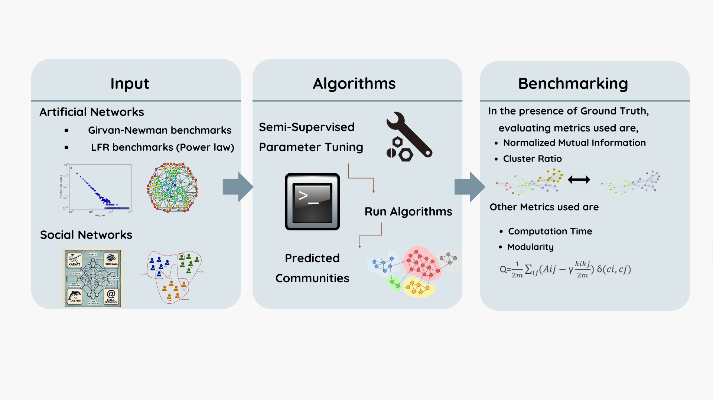

# Extensive Benchmarking of community detection algorithms

## Description
This project contains analysis and results from artificial and social benchmark analysis.

## Benchmark Workflow


## Folder Structure
- `Figures/`: Contains the figures used in the project.
- `LFR_Results/`: Contains results from artificial benchmark analysis.
- `Social_benchmark_results/`: Contains results from social benchmark analysis.
- `Social_networks/`: Contains datasets used for benchmarking.
- `LFR_networks/`: Folders containing LFR networks used for benchmarking.
- `ppi_data/`:Directory containing the data and results from gene enrichment analysis
- `community_detection/`: Contains the Python module developed for implementing community detection algorithms. This directory also includes a README file with detailed information about the package.

## Usage
To reobtain the figures, run the following Jupyter notebooks:
- `LFR_Results.ipynb`
- `Social_Results.ipynb`
- `Estimating_mu.ipynb`
- `Gene_enrichment.ipynb


## Installation
To install the Python module for community detection, navigate to the `community_detection` directory and run:

```bash
pip install .
```
